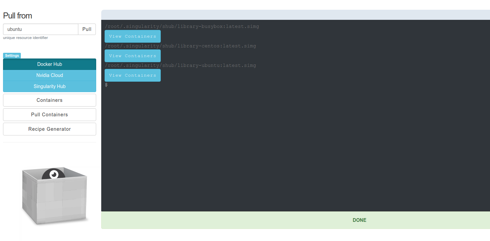

# Tunel

This is the Tunel, giving you interactive management for your containers.

## Goals
A huge challenge with these modern internet protocols is that there is (still) somewhat
of a barrier between a command line and a web interface. We have to do extra work to bridge
that gap, for example delivering restful APIs for a command line client, OAuth2 
flows to authenticate via your platform of choice, or even  sharing your containers with others, period.

"Tunel" is a tunnel between those two things. It takes the technology of some of the
core [container tools](https://singularityhub.github.io/) and brings them together to
have some open source, collaborative fun, and importantly, to help the academic scientist
use container technology. This tool is **under construction** however the basic commands
shown above are working and ready to go! The following things are on the queue:

 - Allow a user to serve a local endpoint to serve their own container API
 - Integration with Globus, meaning you can click to transfer local images to your research cluster.
 - Exposing the remainder of Singularity Registry Global Client endpoints (Google Drive, Storage, Dropbox, etc.) so you can move containers easily from one to another
 - An individual container view to inspect and issue other actions for a container.
 - Integration of the [Builders](https://singularityhub.github.io/builders/) so you can create a recipe, click a button, and have it build on Google Cloud.
 - An ability to easily share containers via the various platforms you connect to.
 - Some kind of integration with Github. I love Github, I can't help it.
 - more robust documentation to match the other Container Tools style!

This is exciting because by way of a web interface, we can very easily bring many more modern tools
to our interaction with containers. There will likely be many changes in the structure and documentation - this first skeleton was a weekend of work and so expect exciting things to come! Please [provide feedback](https://www.github.com/singularityhub/interface/issues) or contribute!

## Interface


You can pull containers from different endpoints! This will eventually include all
the endpoints that [Singularity Global Client](https://singularityhub.github.io/sregistry-cli/clients)
supports, and for now is your bread and butter endpoints.



The settings panel will help to manage tokens which, if you map the database to 
your computer, will only persist there.


Also in development is an interface to make it much easier to generate recipes.


## Quick Start
This will map a local folder, data, to save your container registry database and 
containers, and run the container in detached mode. You have to use priviledged
to pull.

```
$ docker run -d -p 80:80 --privileged -v data:/root vanessa/tunel start
```

It's helpful to give it a name, and then use that for logging, inspection, etc.

```
$ docker run --name tunel -d -p 80:80 --privileged -v data:/root vanessa/tunel start
```
```
$ docker logs tunel
$ docker inspect tunel
```

## Usage
You can use the container directly from Docker Hub. 

```
$ docker run vanessa/tunel help
Usage:
          docker run <container> [start|help]
          docker run -d -p 80:80 -v /tmp/data:/root/.singularity <container> start

          Commands:
             help: show help and exit
             start: the application
         
          Examples:
              docker run -d -p 80:80 <container> -v data:/root/.singularity start
       
```

When you start the container, it will start a web portal to manage your local Singularity Containers. 
This is why you need to map port 80 to your local machine. You also probably want to bind a local
directory (`-v`) so your containers and tiny database are saved:

```
mkdir data
docker run -p 80:80 -v data:/root vanessa/tunel start
```

In the above command we are binding a temporary data directory with root's home in the
container. The reason is because we will have our Singularity image cache, and the Singularity
Registry database generated here. If the container is stopped or removed, the database
and containers will persist. You can also skip the volume and just use it on a temporary basis:


```
docker run -p 80:80 vanessa/tunel start
```


the containers that you pull will be saved:

```
mkdir -p /tmp/data
docker run -p 80:80 vanessa/interface start
```

```
docker run -p 80:80 vanessa/tunel help
```

## Singularity Registry
To interact with your database easily, you can shell inside the container:

```
docker exec -it tunel bash
root@c4e7d18b362b:/code# sregistry shell
[client|hub] [database|sqlite:////root/.singularity/sregistry.db]
Python 3.6.2 |Anaconda, Inc.| (default, Sep 22 2017, 02:03:08) 
Type 'copyright', 'credits' or 'license' for more information
IPython 6.2.1 -- An enhanced Interactive Python. Type '?' for help.

In [1]: client.speak()
[client|hub] [database|sqlite:////root/.singularity/sregistry.db]

In [2]: client.images()
Out[2]: []

In [3]: client.pull('vsoch/hello-world')
Progress |===================================| 100.0% 
2.4.3-dist
{
    "data": {
        "attributes": {
            "deffile": "Bootstrap: docker\nFrom: ubuntu:14.04\n\n%labels\nMAINTAINER vanessasaur\nWHATAMI dinosaur\n\n%environment\nDINOSAUR=vanessasaurus\nexport DINOSAUR\n\n%files\nrawr.sh /rawr.sh\n\n%runscript\nexec /bin/bash /rawr.sh\n",
            "help": null,
            "labels": {
                "org.label-schema.usage.singularity.deffile.bootstrap": "docker",
                "MAINTAINER": "vanessasaur",
                "org.label-schema.usage.singularity.deffile": "Singularity",
                "org.label-schema.schema-version": "1.0",
                "WHATAMI": "dinosaur",
                "org.label-schema.usage.singularity.deffile.from": "ubuntu:14.04",
                "org.label-schema.build-date": "2017-10-15T12:52:56+00:00",
                "org.label-schema.usage.singularity.version": "2.4-feature-squashbuild-secbuild.g780c84d",
                "org.label-schema.build-size": "333MB"
            },
            "environment": "# Custom environment shell code should follow\n\nDINOSAUR=vanessasaurus\nexport DINOSAUR\n\n",
            "runscript": "#!/bin/sh \n\nexec /bin/bash /rawr.sh\n",
            "test": null
        },
        "type": "container"
    }
}
[container][new] vsoch/hello-world:latest@ed9755a0871f04db3e14971bec56a33f
Success! /root/.singularity/shub/vsoch-hello-world:latest@ed9755a0871f04db3e14971bec56a33f.simg
Out[3]: '/root/.singularity/shub/vsoch-hello-world:latest@ed9755a0871f04db3e14971bec56a33f.simg'
```

When you interact in the online interface or on the command line, we will be
updating the same database. This is really great, because it means lots of avenues
for interaction between your command line and all those webby things.

## Development
To develop, we want to be able to make a change locally and quickly view it. To do this,
we can clone the source repository and map it to the container, and then
restart the container. First, clone the repository:


```bash
git clone https://www.github.com/singularityhub/interface
cd interface
docker build -t vanessa/tunel .
```

Then run the container, mapping the repository base to `/code` where... the code
lives. 

```
docker run -p 80:80 -d --name tunel --privileged -v $PWD:/code -v data:/root vanessa/tunel start
```

You can shell inside to debug:

```
docker exec -it tunel bash
```

or restart the container if the server needs some kind of update...


```
docker restart tunel
```

## Acknowledgements

 - [@olifre for docker2oci](https://github.com/olifre/dockerhub2oci/blob/master/LICENSE) The `docker2oci` script to handle the whiteout is essential for any kind of pull to work, because it's broken in Singularity.
 - [Singularityware](https://github.com/singularityware): the Singularity open source community!
 - [The Robots](https://vsoch.github.io/robots): for a continually strong spirit.

