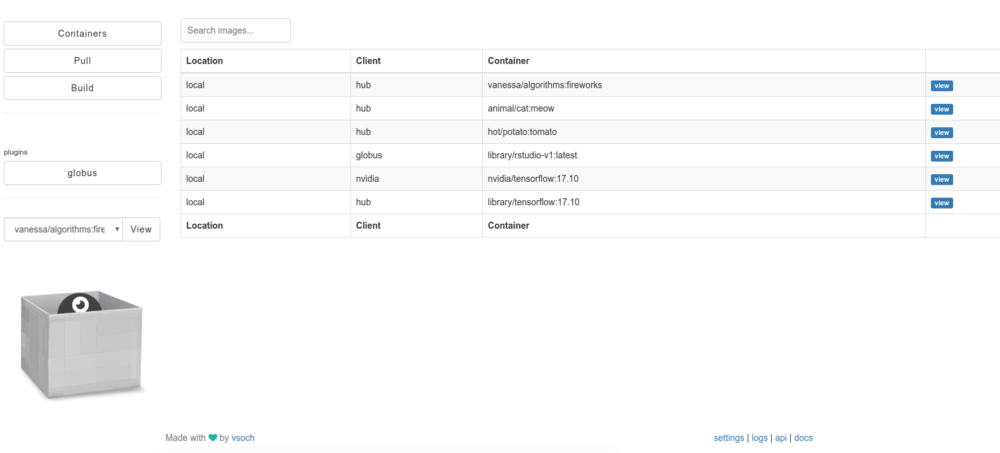

    

  

# Tunel
Welcome to the Tunel documentation! This is the Tunel, giving you interactive management for your containers.

## Goals
A huge challenge with these modern internet protocols is that there is (still) somewhat
of a barrier between a command line and a web interface. We have to do extra work to bridge
that gap, for example delivering restful APIs for a command line client, OAuth2 
flows to authenticate via your platform of choice, or even  sharing your containers with others, period.

"Tunel" is a tunnel between those two things. It takes the technology of some of the
core [container tools](https://singularityhub.github.io/) and brings them together to
have some open source, collaborative fun, and importantly, to help the academic scientist
use container technology. 

## Getting Started
 - [Interface](/interface/ui): A quick introduction to Tunel's interface. That is what the repository is called, after all.
 - [Quick Start](/interface/quick-start): A quick start guide to getting your Tunel up and running!
 - [Development](/interface/development): Helpful commands for development and debugging.

## Plugins

 - [Globus](/interface/plugin-globus): Connect your tunel to Globus to transfer images to and from your Globus endpoints.

## Feedback
We are looking for feedback about what features you would like implemented next!

 - Exposing the remainder of Singularity Registry Global Client endpoints (Google Drive, Storage, Dropbox, etc.) so you can move containers easily from one to another
 - Integration of the [Builders](https://singularityhub.github.io/builders/) so you can create a recipe, click a button, and have it build on Google Cloud.
 - An ability to easily share containers via the various platforms you connect to.
 - An integration with Github?

This is exciting because by way of a web interface, we can very easily bring many more modern tools
to our interaction with containers. Please [provide feedback](https://www.github.com/singularityhub/interface/issues) or contribute!

## Getting Help
This is an open source project. Please contribute to the package, or post feedback and questions as <a href="https://github.com/singularityhub/interface" target="_blank">issues</a>. You'll notice a little eliipsis (<i class="fa fa-ellipsis-h"></i>) next to each header section. If you click this, you can open an issue relevant to the section, grab a permalink, or suggest a change. You can also talk to us directly on Gitter.

## License

This code is licensed under the Affero GPL, version 3.0 or later [LICENSE](https://github.com/singularityhub/interface/blob/master/LICENSE).

## Acknowledgements

 - [@olifre for docker2oci](https://github.com/olifre/dockerhub2oci/blob/master/LICENSE) The `docker2oci` script to handle the whiteout is essential for any kind of pull to work, because it's broken in Singularity.
 - [Singularityware](https://github.com/singularityware): the Singularity open source community!
 - [The Robots](https://vsoch.github.io/robots): for a continually strong spirit.

    <a href="/interface/quick-start"><button class="next-button btn btn-primary"><i class="fa fa-chevron-right"></i> </button></a>

 
